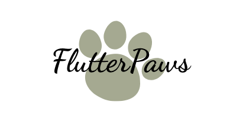

# 🐾 FlutterPaws 🐾

EN | [中文](README_zh.md)

<p align="center">
  
</p>

<div align="center">
  


</div>

<div align="center">
  


</div>


## 📖 Project Overview
FlutterPaws is a comprehensive, cross-platform pet diary application developed using the Flutter framework. Designed to address the core needs of pet owners, this application provides modules for diary entries, schedule management, health tracking, and photo galleries, offering a complete solution for pet lifestyle management.


## 🌟 Core Features

#### 📝 Intelligent Diary System
- Multimedia Support: Combine text, images, and videos to capture memories across various scenarios
- Automatic Tagging: Generates time and type tags automatically, with support for custom tags and classification
- Mood Tracking: Includes a mood selector with emojis (e.g., 😄 Happy, 😴 Sleepy, 🍖 Hungry)
- Templates: Preset templates for growth records, health updates, and memorable moments

#### 📅 Pet Schedule Management
- Triple Reminder System: Feeding (timed/recurring), vaccinations (expiry alerts), grooming (periodic reminders)
- Customizable Events: Support for repeating cycles (e.g., weekly deworming, monthly bathing)
- Color-Coded Calendar: Visualizes events by priority with color-coded tags

#### 🏥 Health Data Management
- Weight Tracking: Interactive charts with weekly/monthly/yearly comparisons
- Vaccination Dashboard: Countdowns for rabies, infectious disease, and other vaccinations
- Medication Reminders: Dosage calculation based on pet weight (e.g., weight × 2mg/kg)
- Quarterly Health Reports: Automatically generated with BMI analysis and vaccination validity tracking

## 🐾 Pet Management App Prototype (MasterGo)

 - **Points Redemption 🛒:** Display of current points balance. "Check Details" button for viewing transaction history. List of redeemable items such as dog food, treats, beds, and water bottles
 - **Home Page 🏠:** Pet profile display including photo, age, breed, and weight. Quick access panel: Daily check-in, health tracking, weight logging, notes, and feeding guide. Follow & recommendation section for community engagement
 - **Weight Tracking 📊:** Graphical representation of weight data over time (line chart). Time range selector (weekly, monthly, yearly view). Display of maximum and minimum recorded weights
 - **User Profile 👤:** User information including avatar, nickname, likes, followers, and following count. List of registered pets. Settings options: theme selection, language preference, and logout function
 - **Calendar Logs 📅:** Calendar-based interface with activity markers. Logging features for bathing, walking, weight recording, etc.Medical records section including hospital name, diagnosis, and description


## 💻 Technical Architecture

#### Core Technology Stack

| Component                 | Version | Description                                     |
| ------------------------- | ------- | ----------------------------------------------- |
| **Flutter**               | 3.7.0   | Cross-platform UI framework                     |
| **Dart**                  | 3.0.0   | Programming language with null safety           |
| **Provider**              | 6.1.2   | State management for themes, language, and data |
| **SharedPreferences**     | 2.2.2   | Local lightweight data persistence              |
| **Flutter Localizations** | -       | Multi-language support system                   |
| **Cupertino Icons**       | 1.0.8   | iOS-style icon library                          |

#### Key Technical Features
1. **Responsive Design**: Adaptive layout using `LayoutBuilder` for consistent experience across phones, tablets, and web
2. **Hybrid Integration**: Native system interactions via `platform_channel` (local notifications, photo gallery access)
3. **Performance Optimization**: Virtualized rendering for large lists with `ListView.builder`


## 📦 Project Structurelib/

```
├── core/              # Core functionality
│   ├── models/        # Data models (Pet.dart, Diary.dart, HealthRecord.dart)
│   ├── services/      # Business logic (NotificationService, HealthService)
│   └── utils/         # Utility classes (DateUtil, ImageUtil, ThemeUtil)
├── presentation/      # UI layer
│   ├── pages/         # Main screens
│   │   ├── HomePage.dart       # Dashboard with diary timeline and quick actions
│   │   ├── CalendarPage.dart   # Schedule visualization
│   │   ├── HealthPage.dart     # Health metrics dashboard
│   │   ├── widgets/       # Reusable components
│   │   │   ├── PetCard.dart        # Pet profile with status indicators
│   │   │   ├── DiaryItem.dart      # Diary entry with media preview
│   │   │   └── ReminderTile.dart   # Reminder widget with countdown
│   ├── config/            # Configuration
│   │   ├── themes/        # Theme settings (Light/Dark modes)
│   │   └── locales/       # Localization resources (zh_CN/en_US)
│   └── main.dart          # Application entry point
```


## 🚀 Quick Start

1. Install [Flutter 3.7.0+](https://flutter.dev/docs/get-started/install)
2. Configure IDE: Android Studio/VS Code with Flutter plugin
3. Verify setup with `flutter doctor`

```
# Clone repository
git clone https://github.com/Echo-Nie/FlutterPaws.git
cd FlutterPaws
```

```
# Install dependencies
flutter pub get
```

```
# Run on default device
flutter run
```

```
# Build release APK (Android)
flutter build apk --release
```

```
# Build release IPA (iOS)
flutter build ios --release
```

## 🔮 Future Enhancements
- [ ] **Pet Social Network**: Community feed and owner networking with location-based matching
- [ ] **AI Health Analysis**: Image recognition for pet emotion detection and predictive analytics
- [ ] **Cloud Sync**: Firebase-powered multi-device synchronization with family account sharing


## 📄 License
This project is released under the MIT open-source license. Commercial use or derivative works require authorization from the author.

> 🌟 If you find this project useful, please give it a ⭐️! Your support drives continuous improvement.


## 🙏 Acknowledgments
Special thanks to the Flutter team for the cross-platform framework, and to the developers of Provider, SharedPreferences, and other open-source libraries. Gratitude also goes to course instructors for guidance and feedback during development.


## 📞 Contact
- GitHub Issues: [Report bugs/request features](https://github.com/Echo-Nie/FlutterPaws/issues)
- Email: [nyxchaoji123@163.com](mailto:nyxchaoji123@163.com)
